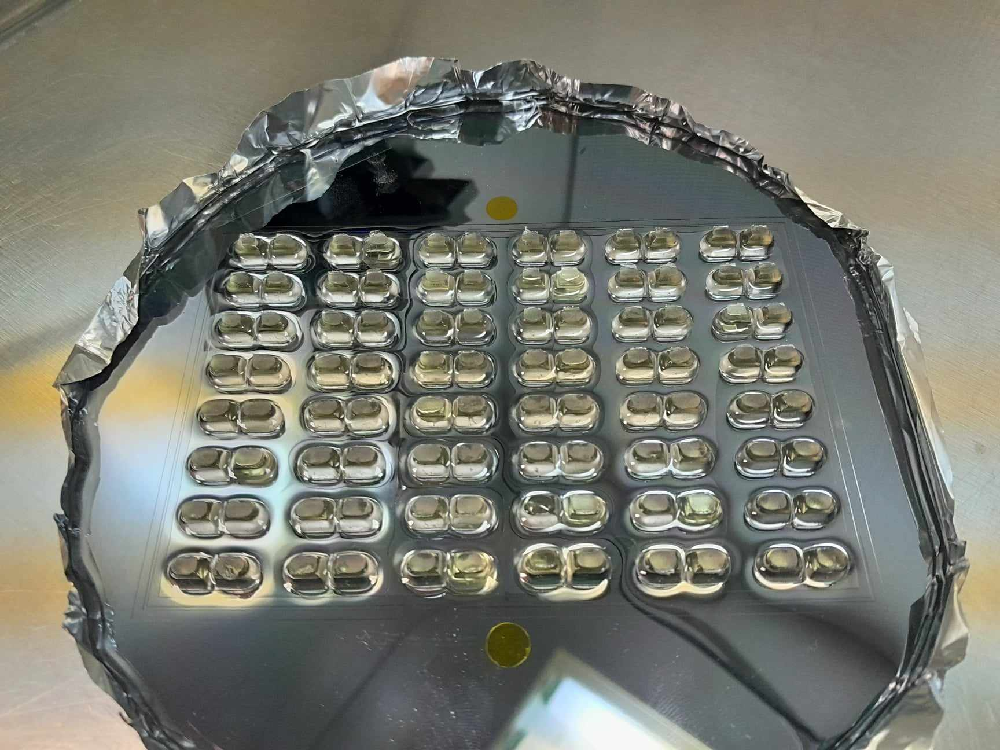
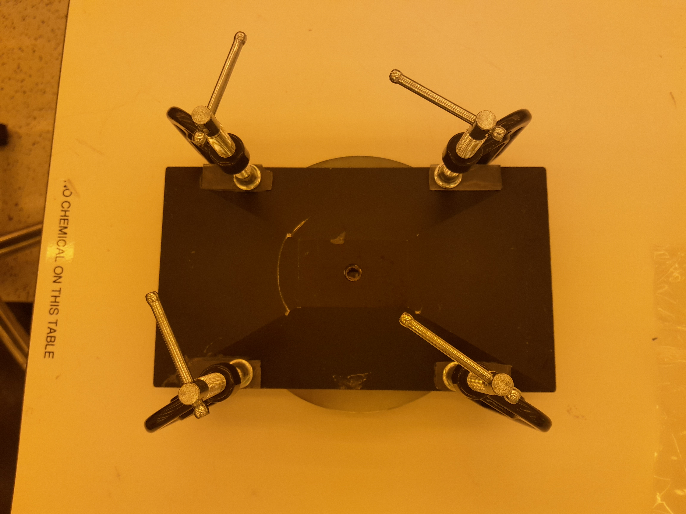
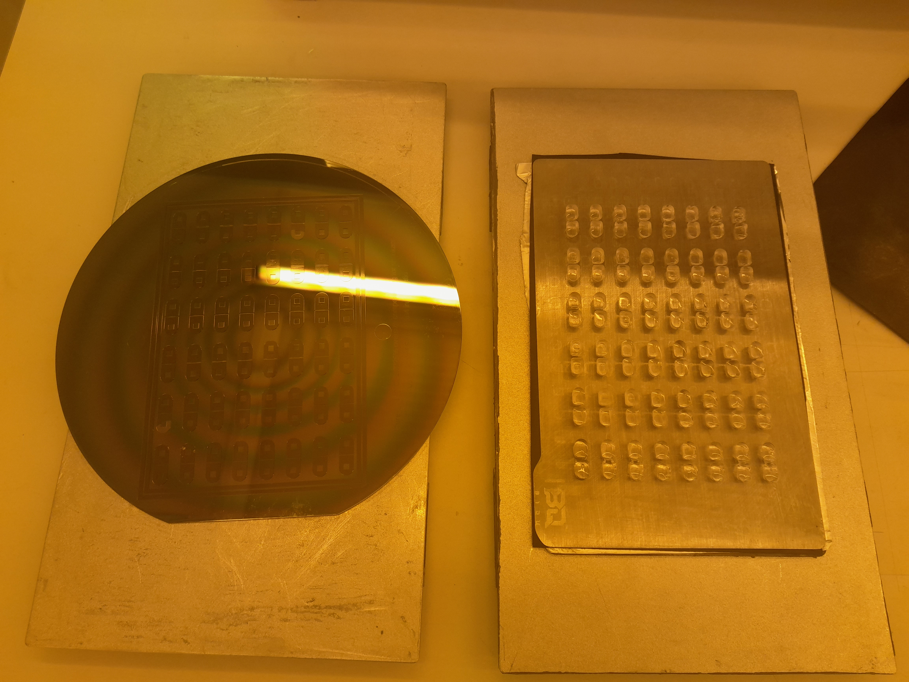
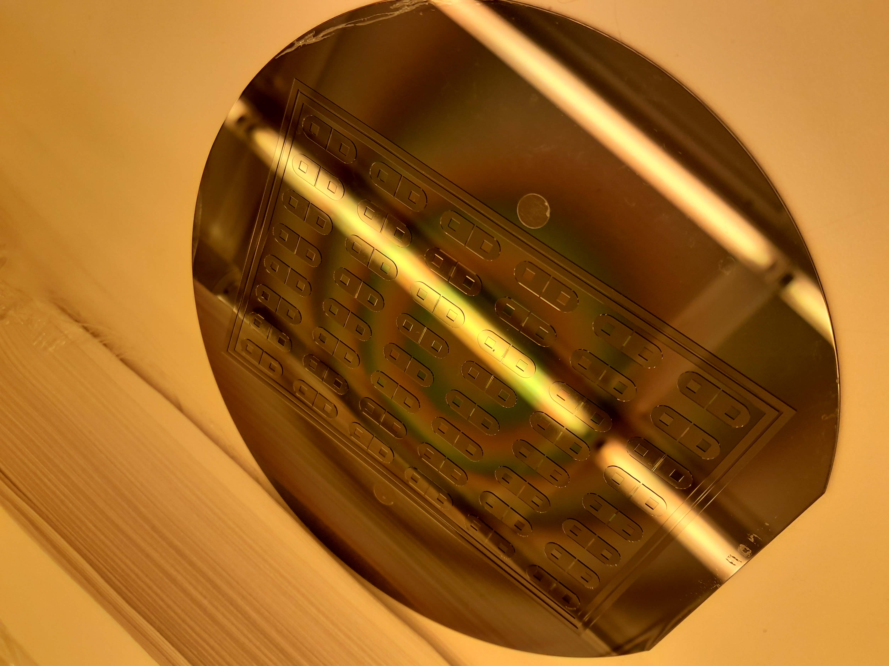
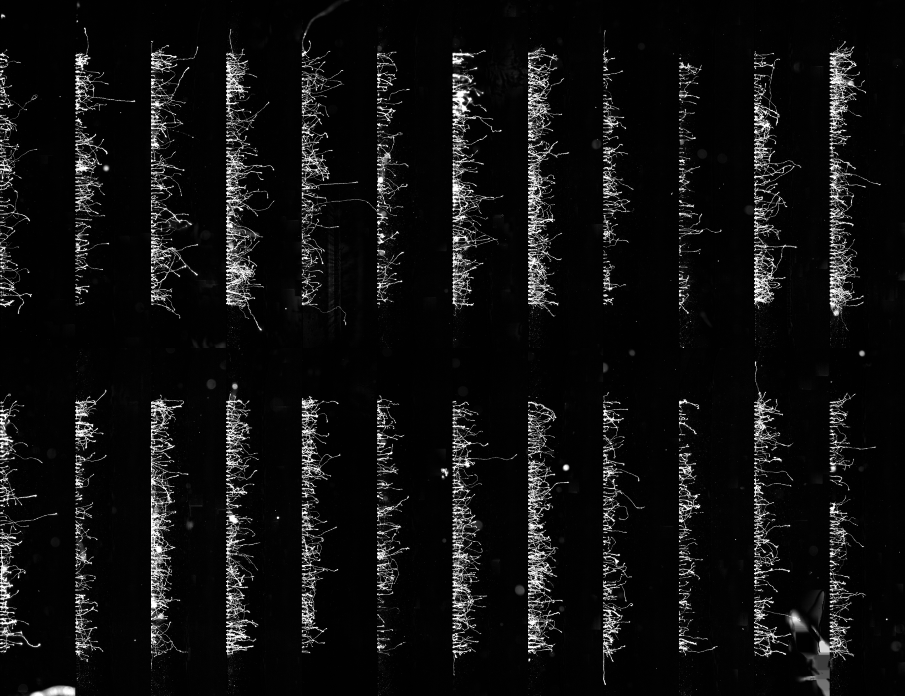
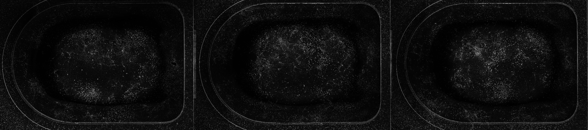
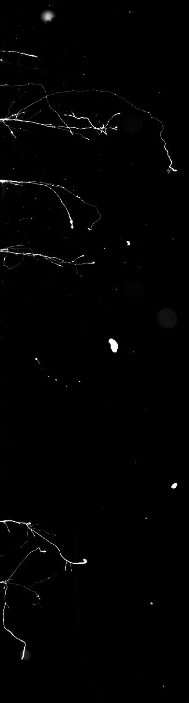

# Hybrid SU-8 + resin-insert molding enables microtiter-plate-format PDMS microfluidics without manual punching (working title)

**Authors:** [TODO]  
**Affiliations:** [TODO]  
**Corresponding author:** [TODO]

## Abstract
High-throughput microfluidic screening remains beyond the reach of most academic labs. While microfluidic devices enable spatial compartmentalization and precise microenvironment control that are impossible in standard multi-well plates, scaling these assays to 96-well format has required either expensive commercial platforms or fabrication methods that exceed the capabilities of typical academic cleanrooms. The barrier is multiscale: cellular assays require micron-scale channels, but automation-compatible wells demand millimeter-scale features—a combination that standard SU-8 photolithography cannot efficiently produce, forcing reliance on manual well punching that does not scale.

Here we present a hybrid mold-fabrication method that enables high-throughput microfluidic screening in academic labs by combining (i) SU-8 photolithography for fine microfeatures with (ii) adhesively bonded, resin 3D-printed well inserts for tall macrofeatures. Mold fabrication requires cleanroom access for photolithography, but all subsequent steps (resin printing, insert bonding, PDMS casting, and device assembly) use only standard benchtop laboratory equipment (resin printer, oven, desiccator, plasma cleaner). Using low-cost resin printing, low-viscosity epoxy bonding, and a lock-and-key alignment scheme, we integrate millimeter-to-centimeter-tall wells with micrometer-scale SU-8 features on a single wafer mold. Wells are formed during PDMS casting rather than by post-processing, eliminating the manual punching bottleneck and enabling academic labs to fabricate 96-well-format versions of established microfluidic assays. This brings automation compatibility, liquid-handling integration, and replicate-rich experimental designs to literature-validated device geometries that have historically been limited to low-throughput formats. By providing an open-source layout generator (OpenMFD) that automates design-rule encoding and fabrication file generation, we enable researchers to iterate on custom assay designs without dependence on commercial platforms. The fabrication method is application-agnostic and compatible with any microfluidic geometry requiring spatial compartmentalization, gradient generation, or co-culture. As a demonstration, we fabricate and validate a 96-well-format compartmentalized culture platform for axon injury and regeneration studies, introducing a liquid-handling-compatible chemical axotomy workflow enabled by the plate-format architecture.

## Introduction
Microfluidic devices enable experimental capabilities in cellular biology that are impossible in standard multi-well plates: spatial compartmentalization of cell populations, localized chemical perturbations, fluidic isolation of subcellular compartments, and controlled microenvironments for studying cell migration, differentiation, co-culture interactions, and response to gradients. Decades of innovation have produced powerful, literature-validated device architectures for applications across neuroscience, stem cell biology, cancer research, immunology, and developmental biology (Taylor et al., 2005; Taylor et al., 2015; Wang et al., 2018; Coquinco et al., 2014), and several low-throughput designs are now commercially available (Xona Microfluidics, Ananda Devices). High-throughput plate-format versions exist but are extremely expensive and beyond the reach of most academic research budgets. These platforms remain fundamentally low-throughput in academic settings: most provide only 1–4 independent culture chambers per device, require manual liquid handling, and are incompatible with multichannel pipettes, liquid-handling robots, and plate-reader imaging systems. **High-throughput microfluidic screening with automation compatibility has remained inaccessible to most academic labs across biological disciplines.**

The barrier is not conceptual (the device geometries work) but fabrication and scale. Academic labs can fabricate low-throughput PDMS devices (1–4 chambers) using standard soft lithography, but scaling to 96-well format has required either (i) commercial platforms that cost thousands of dollars per plate and offer limited design flexibility, or (ii) hard-plastic microfabrication methods (hot embossing, CNC milling, injection molding) that require specialized equipment unavailable in most university cleanrooms. This fabrication gap has prevented academic researchers from accessing high-throughput microfluidic screening, limiting the ability to perform replicate-rich studies, dose-response screens, and automated imaging workflows that are routine in conventional plate-based assays across stem cell biology, cancer research, immunology, and neuroscience. **Equally important, the dependence on commercial platforms prevents researchers from iterating on custom designs or developing novel assay geometries tailored to specific biological questions, limiting innovation to what manufacturers choose to produce.**

The core fabrication challenge is multiscale: cellular microfluidic assays often require microchannels and barriers on the order of a few to tens of micrometers, while robust, pipette-accessible wells demand millimeter-scale depth and volume. SU-8 photolithography reliably yields micron-scale structures, but creating millimeter-tall, large-area wells in SU-8 is difficult and often replaced by manual punching of cured PDMS. Alternative approaches (e.g., laser ablation of PDMS, hot embossing + CNC-milled well layers, direct 3D printing of molds, or modular inserts) either trade away fine resolution, require specialized equipment, or introduce substantial time and alignment burden.

Table 1 summarizes representative strategies to combine micro-scale features with millimeter-scale wells/structures and highlights the trade-offs that motivate a plate-format, “no-punch” PDMS workflow.

**Table 1. Prior art: multiscale microfluidic fabrication strategies (microfeatures + tall wells).**

| Approach | Micro-scale features | Macro wells / tall structures | Plate / automation compatibility | What it typically costs you | Representative refs |
|---|---|---|---|---|---|
| Conventional PDMS soft lithography + manual punching | SU-8 photolithography (µm-scale channels) | Biopsy punch after casting | Limited by manual post-processing; punching becomes the throughput bottleneck | Manual labor, variability, edge defects, hard to scale to 96-well | (baseline approach; see e.g., Taylor et al., 2005) |
| CO₂ laser micromachining of PDMS | Maskless laser ablation; practical widths generally >100 µm | Laser-ablated reservoirs/wells/channels | Serial process; not ideal for dense plate arrays | Limited resolution and non-ideal cross-sections; thermal artifacts | Holle et al., 2007 |
| Micro–macro hybrid master via milling + hot embossing | Hot embossing for microfeatures | PMMA milled macrostructures (mm-scale) | Can replicate PDMS masters in quantity (not inherently plate-format) | Requires hot embosser + milling; multi-master workflow | Park et al., 2010 |
| Thick SU-8 molding + photolithography (single material) | Photolithography on molded SU-8 surface | Millimeter structures molded from 3D-printed master via PDMS mold | Demonstrated as micro-to-mm “seamless” structures (not plate workflows) | Surface roughness can degrade lithography; multi-step SU-8 handling | Tamura & Suzuki, 2019 |
| Direct 3D printing of PDMS onto photolithographic master (“printed soft lithography”) | Photolithographic master for microchannels | Printed PDMS walls/compartments | Removes punching for certain architectures; not inherently microtiter plate-format | Requires PDMS-printing hardware (bioprinter/extrusion) and ink tuning | Kajtez et al., 2020 |
| Aligned SLA printing onto patterned chips | SU-8 lithography on diced chips | SLA-printed micro/macro 3D features | Chip-scale alignment; not wafer-scale or plate-scale workflows | Requires dicing + alignment fixtures; first-layer overcure effects | Pan et al., 2022 |
| 3D-printed inserts bonded to SU-8 (lock-and-key) | SU-8 photolithography for microfeatures | Tall 3D-printed inserts + epoxy bonding | Works for open reservoirs; scaling limited by manual insert handling | Metal printing cost/availability; manual placement effort | Ristola et al., 2019 |
| Hard-plastic microtiter microfluidic plates (industrial) | Hot-embossed microchannels in COC | CNC-milled wells/compartments + fusion bonding | ANSI/SLAS compatible; automation-friendly | Requires specialized tooling/processes; not typical academic fab | Moll et al., 2024 |
| Commercial microfluidic titer plates (proprietary) | Proprietary | Proprietary | High-throughput, plate footprint | Limited design freedom; cost; opaque fab details | Spijkers et al., 2021 (OrganoPlate) |
| **This work: wafer-bonded resin well inserts + SU-8 microfeatures (with OpenMFD design rules)** | SU-8/SUEX photolithography for µm-scale microfeatures | Resin-printed well inserts adhesively bonded to wafer mold; wells formed during casting (no punching) | ANSI/SLAS footprint; demonstrated with HCS imaging + autofocus (Opera Phenix, ImageXpress) | Requires reliable bonding workflow + final mold insulation (e.g., parylene coating) | **This work** |

In this work, we address this multiscale fabrication bottleneck by integrating resin-printed well inserts onto an SU-8 wafer mold via adhesive bonding and mechanical self-alignment. The resulting hybrid mold produces PDMS devices with wells cast in place—no punching—while preserving fine SU-8-defined microfeatures. The fabrication method is application-agnostic: any microfluidic geometry that can be patterned in SU-8 can be integrated with 3D-printed well arrays to create plate-format devices. Because the technique introduces plate-format constraints (insert alignment features, keep-out zones, tiling, and standardized footprints), we provide an accompanying open-source Python layout generator (OpenMFD) as part of the platform to encode these design rules and generate fabrication-ready layouts. While we demonstrate the platform using a neuroscience application (compartmentalized axon injury assays), the approach is compatible with any cellular assay requiring spatial compartmentalization, gradient generation, co-culture, or controlled microenvironments.

## Materials and Methods
### Design automation (open-source Python layout generator)
OpenMFD: an open-source Python layout generator for plate-format microfluidics and hybrid molds (`https://github.com/trissim/OpenMFD`).

OpenMFD is designed to reduce device-design friction for plate-format PDMS microfluidics by providing parameterized geometric primitives (wells, chambers, channels), array/tiling utilities, and multi-layer alignment marks. The software generates fabrication outputs for both parts of the platform: (i) photolithography masks for SU-8/SUEX microfeatures and (ii) CAD for 3D-printed well inserts used to form tall wells without punching.

OpenMFD represents geometry as OpenSCAD models (via SolidPython) and supports export to:
- **OpenSCAD (`.scad`)** for inspection and as an intermediate format
- **DXF (`.dxf`)** for photomask printing (via OpenSCAD CLI conversion with DXF normalization using `ezdxf`)
- **STL (`.stl`)** for 3D printing and visualization (via OpenSCAD/viewscad tooling)

Layer separation is handled by exporting separate geometries for each fabrication layer (e.g., channel layer vs well/chamber layer), with corresponding **full vs hollow alignment marks** to support multi-layer registration. Features related to insert alignment are represented both as 3D insert geometry (pins, skirts, tapers) and as matching “lock” features (e.g., square holes) in the photolithographic layer(s).

### SU-8 fabrication of microfeatures
We fabricate fine microfeatures using a three-layer negative photoresist stack consisting of two thin SU-8 2005 layers (MicroChem) and a thick SUEX K200 dry-film layer (DJ MicroLaminates). Unless otherwise noted, processing steps for SU-8 2005 follow the manufacturer’s recommendations for a 5 µm target thickness.

Microchannels and thin well-rim features are patterned in SU-8 using standard photolithography on silicon wafers. Alignment marks are included for later lock-and-key registration with the 3D-printed inserts.

**Layer 1 (base):** SU-8 2005, 5 µm. The resist is flood-exposed (no mask) and is not developed. This layer serves as an adhesion promoter: without it, thin SU-8 microchannel features patterned directly on bare silicon can delaminate from the wafer surface during development or subsequent processing (Supplementary Note S2).

**Layer 2 (microchannels):** SU-8 2005, 5 µm. The resist is exposed through a photomask defining the microchannel layer, followed by development.

**Layer 3 (tall SU-8/SUEX features):** SUEX K200 (dry film, DJ MicroLaminates), 200 µm. Exposure is performed through a 360LP filter at a dose of 2800 mJ/cm². Post-exposure bake (PEB) is performed in an oven by ramping from room temperature to 50°C at 1°C/min, holding at 50°C, then ramping down by powering off the oven. Development is performed by submerging the wafer in developer and mixing for 20 min, with a developer exchange at 15 min. A hard bake is then performed by ramping from room temperature to 180°C at 3°C/min, holding for 30 min, and ramping down by powering off the oven.

We use 6" silicon wafers (UniversityWafer, ID857). SU-8 2005 is sourced from Kayaku Advanced Materials, and SUEX K200 (6") is sourced from DJ MicroLaminates. SU-8 layers are spin-coated using a Laurell WS-650-8B spin coater, and SUEX K200 is laminated using an SK 335R6 laminator. Photomask exposure/alignment is performed using an EVG620 mask aligner. No dehydration bake or HMDS treatment is used; the flood-exposed SU-8 base layer provides sufficient adhesion for the microchannel layer without additional surface preparation.

For development of both SU-8 and SUEX layers we use propylene glycol monomethyl ether acetate (PGMEA) supplied by the facility.

Use of the LP360 long-pass filter during SUEX exposure was critical for achieving a flat top surface on the SUEX features. Without the LP360 filter, we observed ridge-like edge artifacts that prevent a uniform epoxy seal when bonding the resin inserts to the wafer mold, compromising the insert–wafer interface (Supplementary Note S1).

[TODO: typical defect modes (cracking/delamination) and mitigations]

### Resin 3D printing of well inserts
[TODO: layer height; post-processing; dimensional compensation]

Well inserts are printed using an Elegoo Mars 3 Pro resin printer and a high-temperature resin (Siraya Tech Sculpt, Clear).

Well inserts are printed as an array such that each insert contains a protruding alignment pin (“key”). The SU-8 design contains corresponding holes (“locks”) at the intended insert locations. Insert height sets the molded well depth during PDMS casting.

### Insert transfer, alignment, and adhesive bonding
To avoid time-consuming manual placement of individual inserts, inserts are printed in their correct relative positions on a detachable magnetic build plate (or equivalent transfer fixture). The insert array is then transferred onto a larger bonding plate suitable for clamping against a full wafer.

Low-viscosity epoxy is applied in excess to a cavity on the underside (pin side) of each insert. The wafer is placed with SU-8 features facing the insert pins and is aligned until all pins seat into their corresponding SU-8-defined holes, providing self-alignment across the full insert array. A second flat plate is placed above the wafer, and uniform pressure is applied using clamps to spread epoxy at the insert–wafer interface.

The lock-and-key alignment is designed with 150 µm total clearance: 1.85 × 1.85 mm pins seat into 2.0 × 2.0 mm square holes (75 µm per side). This tolerance accommodates expected fabrication variation in both SU-8 photolithography and resin 3D printing while ensuring deterministic mechanical registration across the full insert array. Alignment precision is geometry-limited by the CAD-defined clearances, not by manual placement.

To compensate for measured print-to-print and across-build-area variation in insert pin height (z) (Supplementary Table S1; peak-to-peak variation 116 µm across one 8×12 array), a compliant rubber sheet is placed between the insert array build plate and the clamping surface. This compliance equalizes pressure across the array and helps ensure all pins fully seat during alignment and bonding.

We use an EPDM rubber sheet (0.03125 in thickness, 60A durometer) positioned between the fixed magnet on the clamping build plate and the removable magnetic build plate carrying the inserts. This allows locally taller inserts to sink into the rubber under clamping, helping ensure the pin bases and bonded insert–wafer interface are flat.

Before curing, the clamped assembly is immersed in acetone to remove excess epoxy that may have leaked onto the SU-8 microfeatures. The assembly is then cured at room temperature for 48 h. We avoid elevated-temperature curing to minimize thermally induced stresses under clamping that can compromise the insert–wafer seal.

We use EPO-TEK 301-2 epoxy and follow the manufacturer’s minimum alternative cure schedule (room temperature cure) to minimize thermal stress at the bonded interface. After clamping and alignment, the assembly is submerged in an acetone bath for 1 min, followed by a second 1 min acetone wash, then dried using a dry air gun prior to curing.

[TODO: masking strategies if any; failure modes + mitigations]

### Parylene insulation coating
After insert bonding, the assembled hybrid mold is coated with 1 µm parylene C to insulate the 3D-printed resin (and adhesive) from downstream PDMS casting and cell culture. Parylene deposition was performed using the Specialty Coating Systems (SCS) 200 parylene coater available at the McGill Nanotools Micro, Nanofabrication Facility.

[TODO: how thickness is verified (e.g., witness sample + profilometry/ellipsometry); impact on demolding lifetime]

### PDMS casting and device assembly
PDMS (Sylgard 184) is mixed at a 10:1 base:curing-agent ratio, degassed for 20 min at −15 inHg, and cured for 30 min at 100°C. PDMS is cast onto the hybrid mold such that the tall insert features define the wells during curing. Casting can be parallelized by pouring, degassing, and curing multiple molds in parallel. No silanization is used; the parylene-coated mold improves PDMS release and provides insulation. After curing and demolding, the device is bonded to a substrate (e.g., glass) following standard plasma bonding protocols.

To improve demolding reliability, macro-scale mold features should avoid vertical 90° walls; draft angles and tapered walls facilitate demolding, consistent with prior insert-assisted mold designs. During demolding, the wafer should be supported on a flat surface while applying force to reduce the risk of snapping. We typically initiate demolding from corners and progress toward the center, pulling not only upward but also backward to stretch the PDMS and reduce local peel stress.

Because PDMS shrinks at elevated curing temperatures, device geometry can be uniformly scaled to compensate; OpenMFD includes built-in support for applying a shrinkage-compensation scale factor during export.

### Device trimming, framing, and final assembly (plate-format package)
To facilitate rapid, repeatable device packaging, the mold includes a rectangular cutting guide surrounding the array. After demolding, devices are trimmed to a standardized rectangular footprint using an industrial paper guillotine aligned to this guide.

The trimmed PDMS device is bonded to a 110 × 74 mm coverslip-glass sheet. The PDMS-on-glass assembly is autoclaved (121°C, 30 min) and then mounted into a 3D-printed plastic frame by applying Loctite 5140 to the frame and placing the glass onto the adhesive interface. The frame is sterilized with 70% ethanol prior to assembly. The adhesive is cured at room temperature for at least 24 h.

3D models for the frame are provided by OpenMFD. Among the materials evaluated for frame printing, high-impact polystyrene (HIPS; polystyrene modified with rubber) was the only material that combined sufficient print fidelity for the required geometries with compatibility in neuronal culture workflows. HIPS is chemically similar to the polystyrene used in standard cell-culture plasticware.

Frames are printed using a Creality K1C printer with black HIPS filament (e.g., Filamentum or eSUN). To reduce warping due to thermal contraction, enclosed printing is required; we found it beneficial to disable part-cooling fans, use a high bed temperature, and print with a brim for bed adhesion.

[TODO: print temperatures/speeds and other slicer settings; Loctite 5140 curing conditions (humidity/temperature); confirm autoclave cycle]

### Pre-use plasma cleaning
After Loctite curing, assembled devices are plasma-cleaned using a Harrick PDC-001 benchtop plasma system (high power; 30 W, 10 min, 400 mTorr) to further sterilize the device and render surfaces hydrophilic before coating and neuronal culture. Dry ambient air is used as the process gas to control for humidity.

### Demonstration assay: plate-format axon injury and regeneration
[TODO: cell type/source; plating density; media; timeline]

We demonstrate a plate-format axon isolation / injury assay in which axons are selectively injured via “chemical axotomy” delivered by automated liquid handling. Regrowth and survival are quantified by imaging-based readouts.

Chemical axotomy is performed at 11 days in vitro (DIV11) using a mixture of trypsin and 0.0125% Triton X-100 applied for 5 min. A volume gradient is maintained across compartments to fluidically isolate the axotomy mixture within the axon compartment. After axotomy, the device is washed once with DMEM + FBS to neutralize trypsin, then washed twice with supplemented Neurobasal (N2 1%, B27 2%, glutamine 1%, penicillin-streptomycin 1%) prior to addition of any experimental treatments.

To label neurons that extended axons across compartments, cholera toxin subunit B (CTB) was used for retrograde labeling. CTB-647 was applied 24 h prior to axotomy, and CTB-568 was applied 1 day prior to endpoint imaging.

In a typical workflow, we maintain 50 µL in the soma (cell body) compartment and 25 µL in the axon compartment to maintain fluidic isolation. CTB is applied at 1 µg/mL to the axon compartment to label cell bodies retrogradely.

[TODO: confirm axotomy incubation time (5 min vs 10 min); trypsin product and working concentration; Triton X-100 stock and dilution basis; CTB supplier; imaging endpoints and quantification pipeline]

## Results
### Hybrid mold fabrication and well formation without punching
The hybrid mold integrates millimeter-to-centimeter-tall well structures with SU-8-defined microfeatures on a single silicon wafer mold. During PDMS casting, the wells are formed in-place by the insert macros, eliminating manual punching and associated variability.

Protocol development required systematic identification of critical failure modes. Early attempts yielded >50 failed molds, each exhibiting catastrophic defects (insert delamination, SUEX surface non-flatness preventing epoxy sealing, or SU-8 microchannel delamination). Mold outcome is effectively binary: omitting any single critical mitigation results in complete failure, while applying all mitigations together yields 100% functional devices with all wells usable.

Key mitigations identified through iterative development include: (i) LP360 long-pass filtration during SUEX exposure to eliminate ridge artifacts that compromise insert–wafer sealing (Supplementary Note S1), (ii) flood-exposed SU-8 base layer to prevent microchannel delamination during development (Supplementary Note S2), (iii) slow thermal ramping (1–3°C/min) during SUEX post-exposure bake and hard bake to prevent stress-induced delamination, (iv) compliant rubber layer in the bonding fixture to accommodate insert height variation and ensure uniform pressure distribution across the array (Supplementary Table S1), (v) detachable magnetic build plate that enables post-cure disassembly by flexing the thin magnetic sheet to release bonded inserts from the transfer fixture, and (vi) room-temperature epoxy cure to minimize thermally induced stress at the bonded interface.

Once all mitigations were applied, we achieved 100% fabrication success: three consecutive molds fabricated back-to-back all produced defect-free PDMS devices. Across these three molds, we generated >50 usable PDMS casts with no protocol-related failures. One additional mold was physically broken during demolding due to improper handling, confirming that the limiting failure mode is user technique rather than insert delamination or loss of casting fidelity. The most recent mold fabrication occurred >8 months prior to writing, and the molds remain in active use with no observable degradation.

### Throughput and automation compatibility
By integrating wells during PDMS casting rather than post-processing, the workflow eliminates the manual punching step entirely. The resulting devices adopt standard microtiter plate pitch and are directly compatible with multichannel pipettes, liquid-handling robots, and plate-format imaging systems without adaptation. This architectural shift—from serial manual post-processing to parallel batch fabrication—enables 96-well-format devices (or higher density arrays) as a routine output rather than a specialized, labor-intensive configuration.

We verified full microplate compatibility in high-content screening workflows by imaging devices on Opera Phenix and ImageXpress HCS microscopes, where plate-reader autofocus operated reliably across all wells without modification or calibration.

### Platform generalizability: adaptation of published microfluidic designs

To demonstrate that the hybrid mold approach is geometry-independent, we used OpenMFD to adapt multiple published microfluidic architectures into 96-well-format layouts. Figure X shows photomask layouts (DXF) and matching well insert models (STL) for three representative device types: (i) compartmentalized axon injury chambers adapted from Taylor et al. (2005), which we fabricated and validated in this work, (ii) oligodendrocyte myelination platforms based on Ristola et al. (2019), and (iii) axon guidance chambers with orthogonal gradient channels adapted from Taylor et al. (2015).

For each design, OpenMFD generates the full fabrication specification: multi-layer photomask files with alignment marks, 3D-printable well insert arrays with lock-and-key registration features, and optional plate-frame CAD for final assembly. The design-to-fabrication workflow requires only geometric input parameters (channel widths, chamber dimensions, well pitch); OpenMFD encodes the plate-format constraints, tolerance clearances, and hybrid mold integration features automatically.

While we focus fabrication and biological validation on the axon injury platform, the ability to render diverse published geometries as plate-compatible layouts demonstrates that the approach is not device-specific. The hybrid mold fabrication protocol (SU-8 microfeatures + bonded inserts + parylene coating) is geometry-agnostic, constrained only by the design rules outlined in the Discussion.

![Figure X: Platform generalizability across published microfluidic architectures. (A-C) DXF photomask renders for three device types adapted to 96-well format: (A) compartmentalized axon injury chamber (Taylor et al., 2005; fabricated and validated), (B) oligodendrocyte myelination platform (Ristola et al., 2019), (C) axon guidance device with orthogonal gradients (Taylor et al., 2015). (D-F) Corresponding STL models of matching well insert arrays. (G) Photograph of fabricated axon injury device demonstrating integrated well formation.](figures/drafts/testing/representative-ctb1.jpg)

### Demonstration of chemical axotomy in a 96-well-format device
[TODO: insert representative results narrative showing functional neuron culture, successful axon isolation across compartments, effective chemical axotomy, and imaging-based readouts. Confirm devices support standard culture timelines (DIV11+) and are compatible with automated liquid handling for axotomy delivery.]

## Discussion
The presented method addresses a key multiscale fabrication challenge in PDMS microfluidics by decoupling fine microfeature definition (SU-8) from tall macrofeature creation (3D-printed inserts). The lock-and-key alignment and array-wise transfer reduce the manual burden typically associated with modular insert approaches, and adhesive bonding enables use with low-cost, widely available resin printers.

A central finding of this work is that hybrid mold fabrication exhibits binary outcomes: when critical process mitigations are applied together, the protocol is robust and reproducible; when any single mitigation is omitted, catastrophic failure occurs. This sensitivity initially posed a development challenge but ultimately yielded a mature protocol with well-characterized failure modes and clear mitigation strategies. Each mitigation addresses a specific physical or chemical incompatibility (e.g., SUEX surface flatness for sealing, SU-8 adhesion for feature integrity, slow thermal ramping to prevent stress-induced delamination, compliant rubber layer for height variation tolerance, detachable magnetic fixturing for post-cure disassembly, and room-temperature epoxy cure to minimize thermal stress), and the integrated protocol leverages these insights to achieve deterministic success. The binary nature of the outcome also simplifies quality control: molds are either fully functional or immediately identifiable as failed, with no intermediate "partially working" state that might introduce subtle experimental artifacts.

An important design philosophy of this platform is to enable plate-format adaptations of established microfluidic assays rather than requiring de-novo device development. Many proven PDMS microfluidic geometries—compartmented chambers (Taylor et al., 2005; Ristola et al., 2019), gradient generators (Taylor et al., 2015), and co-culture platforms (Coquinco et al., 2014)—remain limited to low-throughput formats (1-4 independent units per device) because fabrication methods that scale to plate formats typically sacrifice either microfeature resolution or require prohibitively expensive tooling. By decoupling fabrication scale from geometric complexity, our approach allows these literature-validated architectures to be directly adapted into 96-well layouts without modification to the core microfluidic geometry. OpenMFD automates this translation: published device dimensions can be input as parameters, and the software generates both the photomask layouts (preserving the original channel/chamber geometry) and the matching well insert arrays (adding plate-compatible reservoirs). This "geometry-preserving scaling" enables researchers to leverage decades of microfluidic assay development while gaining throughput, automation compatibility, and replicate richness previously available only in hard-plastic commercial platforms.

Beyond adapting existing designs, this platform enables the creation of entirely new microfluidic assays by making custom fabrication accessible to researchers without specialized microfabrication expertise. Because OpenMFD automates the translation from geometric parameters to fabrication-ready files (photomasks, 3D-printable inserts, and assembly fixtures), researchers can prototype custom device architectures without requiring expertise in CAD, photomask layout, or design-rule encoding. The mold fabrication workflow requires cleanroom access for photolithography, but all downstream steps (resin printing, insert bonding, PDMS casting, plasma bonding, and device assembly) use only benchtop laboratory equipment. This separation of cleanroom-dependent and lab-based steps enables a collaborative fabrication model: a single cleanroom-equipped facility can produce reusable molds for multiple research groups, while individual labs retain control over device casting, assembly, and iteration. **By enabling researchers to fabricate their own devices, the platform makes microfluidic innovation accessible to labs that previously depended on commercial platforms.**

While we demonstrate the platform using a neuroscience application (compartmentalized axon injury and regeneration), the fabrication method is application-agnostic and compatible with any cellular assay requiring spatial control of microenvironments. Potential applications span stem cell differentiation studies (where compartmentalized culture enables independent control of niche factors), cancer metastasis models (where migration barriers and gradient channels can model invasion), immune cell interaction assays (where co-culture compartments enable controlled cell-cell contact), organoid culture platforms (where fluidic isolation enables independent media conditions), and high-throughput drug screening (where automation compatibility enables dose-response studies). The hybrid mold approach imposes minimal constraints on microfluidic geometry: any feature that can be patterned in SU-8 can be integrated with 3D-printed well arrays, making the platform broadly applicable across cellular biology.

Key limitations and considerations include: (i) dimensional tolerances and resin shrinkage that affect alignment and sealing, (ii) long-term mechanical stability of the adhesive bond over repeated PDMS casting cycles, (iii) solvent compatibility and handling safety (e.g., acetone cleanup), and (iv) potential constraints on channel proximity to the insert–wafer interface.

### Design rules encoded in OpenMFD
The fabrication method imposes practical multiscale constraints that we encode in OpenMFD to reduce design ambiguity and improve reproducibility:

- **Plate-format layout and keep-outs:** Arrays are generated by tiling a unit device into microtiter-compatible footprints while respecting well pitch and edge clearances needed for handling and imaging.
- **Multi-layer alignment marks:** OpenMFD can place full and hollow alignment marks in user-selected locations to support multi-layer photolithography registration.
- **Lock-and-key insert registration:** Insert pins and matching wafer holes are defined together in CAD; the reference geometry uses 1.85 × 1.85 mm pins and 2.0 × 2.0 mm square holes (150 µm total clearance).
- **Macrofeature demolding:** Tall macro features should avoid vertical 90° walls; draft angles/tapers reduce demolding forces and reduce risk of handling failures.
- **Shrinkage compensation:** Designs can be uniformly scaled to compensate PDMS shrinkage for specific curing conditions.

[TODO: add the specific plate standard targeted (e.g., ANSI/SLAS); document the minimum tested feature sizes and any quantitative tolerance budgets used in design]

## Conclusion
Hybrid bonding of resin 3D-printed well inserts onto SU-8 microfeature wafers enables rapid fabrication of plate-format PDMS microfluidic devices without manual well punching. This approach supports higher throughput, improved compatibility with automation, and flexible device design via an accompanying open-source layout generator. The fabrication method is application-agnostic and compatible with any microfluidic geometry, making high-throughput compartmentalized cellular assays accessible to academic labs across biological disciplines.

## Code and data availability
OpenMFD (design automation, example designs, and layout-generation code): `https://github.com/trissim/OpenMFD`.

OpenMFD includes the CAD used for this platform (photomask DXFs, 3D-printed insert models, and the HIPS frame models used for plate-format assembly).

OpenMFD commit used for this manuscript: `49a0eadba19baa42d610e0c387d8f1149cd2fbfc`.

Supplementary Table S1 (pin height / z variability): `supplementary/Supplementary_Table_S1_pin_z_variability.md` (derived from raw measurements in `pin_z_variability.xlsx`).

Supplementary Protocol S1 (device assembly and axotomy assay): `supplementary/Protocol_S1_device_assembly_and_axotomy.md` (source: `papers/MFD_assembly_and_axotomy_assay copy.odt`).

Supplementary Note S1 (LP360 filter and SUEX flatness): `supplementary/Supplementary_Note_S1_LP360_filter.md`.

Supplementary Note S2 (base layer adhesion and microchannel delamination): `supplementary/Supplementary_Note_S2_base_layer_adhesion.md`.

[TODO: add a tagged release/commit hash used for this paper; add repository location for fabrication protocols, mask files, and analysis scripts; add Video S1 reference/link if you plan to release it]

## Acknowledgements
[TODO]

## References (working list)
- Taylor, A. M., et al. *A microfluidic culture platform for CNS axonal injury, regeneration and transport.* Nat. Methods (2005). https://doi.org/10.1038/nmeth777
- Taylor, A. M., Menon, S., Gupton, S. L. *Passive microfluidic chamber for long-term imaging of axon guidance in response to soluble gradients.* Lab Chip (2015). https://doi.org/10.1039/c5lc00503e
- Wang, Z. Z., Wood, M. D., Mackinnon, S. E., Sakiyama-Elbert, S. E. *A microfluidic platform to study the effects of GDNF on neuronal axon entrapment.* J. Neurosci. Methods (2018). https://doi.org/10.1016/j.jneumeth.2018.08.002
- Coquinco, A., et al. *A microfluidic based in vitro model of synaptic competition.* Mol. Cell. Neurosci. (2014). https://doi.org/10.1016/j.mcn.2014.03.001
- Holle, A. W., et al. *Characterization of Program Controlled CO2 Laser-Cut PDMS Channels for Lab-on-a-chip Applications.* Proc. IEEE Conf. on Automation Science and Engineering (CASE) (2007).
- Park, J., Li, J., Han, A. *Micro-macro hybrid soft-lithography master (MMHSM) fabrication for lab-on-a-chip applications.* Biomed. Microdevices (2010). https://doi.org/10.1007/s10544-009-9390-9
- Tamura, T., Suzuki, T. *Seamless fabrication technique for micro to millimeter structures by combining 3D printing and photolithography.* Jpn. J. Appl. Phys. (2019). https://doi.org/10.7567/1347-4065/ab09d0
- Kajtez, J., et al. *3D-Printed Soft Lithography for Complex Compartmentalized Microfluidic Neural Devices.* Adv. Sci. (2020). https://doi.org/10.1002/advs.202001150
- Pan, J. Y., et al. *Hybrid microfabrication of 3D pyrolytic carbon electrodes by photolithography and additive manufacturing.* Micro Nano Eng. (2022). https://doi.org/10.1016/j.mne.2022.100124
- Ristola, M., et al. *A compartmentalized neuron-oligodendrocyte coculture device for myelin research: design, fabrication and functionality testing.* J. Micromech. Microeng. (2019). https://doi.org/10.1088/1361-6439/ab16a7
- Moll, L., et al. *A Microfluidic High-Capacity Screening Platform for Neurological Disorders.* ACS Chem. Neurosci. (2024). https://doi.org/10.1021/acschemneuro.3c00409
- Spijkers, X. M., et al. *A directional 3D neurite outgrowth model for studying motor axon biology and disease.* Sci. Rep. (2021). https://doi.org/10.1038/s41598-021-81335-z
